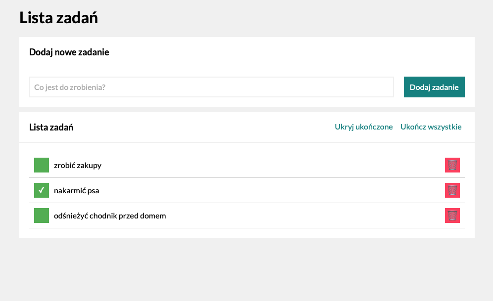

# To Do List Project

## Description

Simple To Do List project. In this project I use BEM convention in CSS and some functions in JavaScript with ECMAScript 6 standard.
This was one of my exercises in the Java Script course.

## Updates

- Added two additional buttons (Show/Hide completed tasks & Mark all tasks as complete)
- Added transform effect to all buttons
- Refactored according to immutability

## Screenshot

## DEMO

https://przema.github.io/todo-list/
